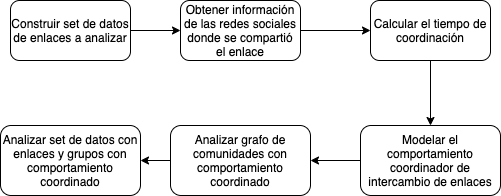
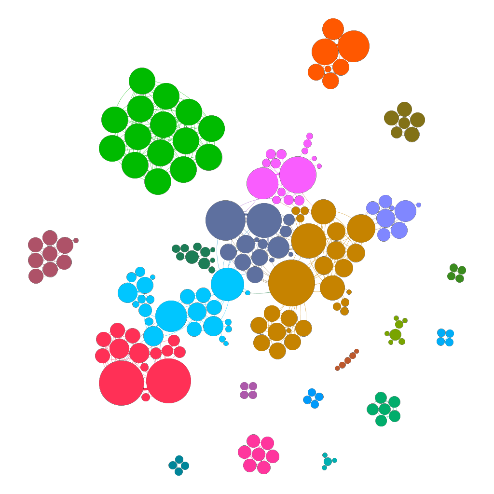
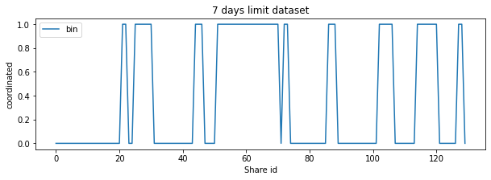
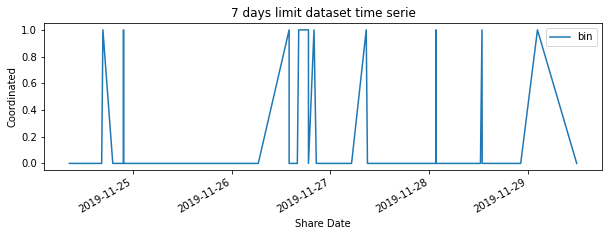
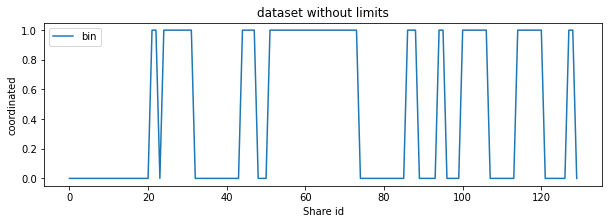
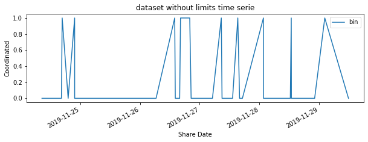
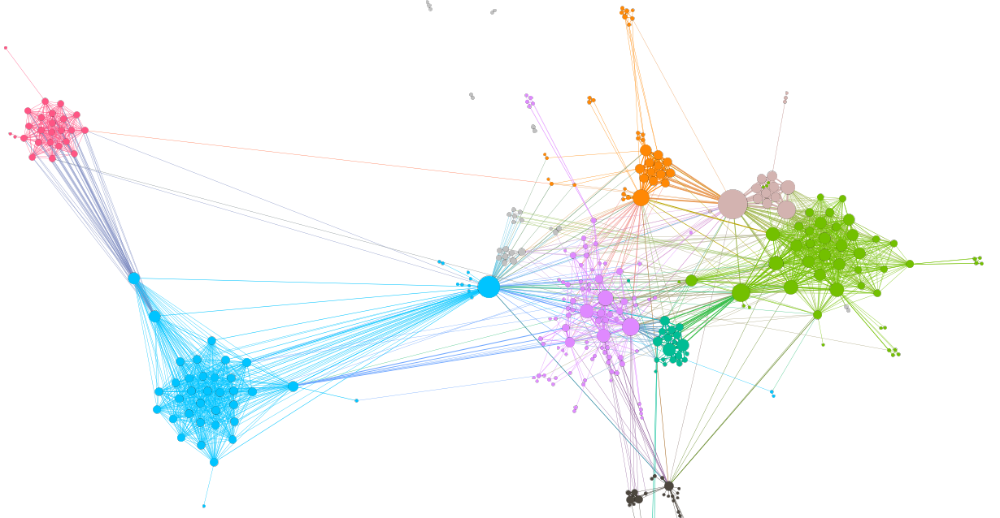

# Resumen
Gracias al uso masificado de las redes sociales y de su inmediatez, la difusión de noticias ha cobrado una relevancia importante, lo que antes tardaba una gran cantidad de tiempo en difundirse, actualmente solo en unos minutos puede volverse viral. Este tipo de comportamientos tienen una gran influencia en la opinión de las masas, ejemplos de esto son los resultados de votaciones populares como el plebiscito por la paz en Colombia del 2016, las elecciones presidenciales de Estados Unidos de América o el referendo para que el Reino Unido abandonara la Unión Europa (Brexit). Este artículo presenta una propuesta para la detección de publicaciones en redes sociales que manera ficticia y coordinada comparten una noticia con el fin de aprovecharse de los algortimos de las redes sociales para viralizarlas e influir en la opinión de los usuarios. Para ello, se han realizado ETL (Extracción, Transformación y Carga) de datos extraidos de la red social Facebook. Se han utilizado herramientas de inferencia estadística y  aprendizaje de máquinas para crear un modelo no supervisado y así obtener un tiempo de coordinación, el cuál es utilizado por otro modelo que entrega como resultados una clasificación binaria que indica si el enlace compartido tiene el comportamiento de estudio y un grafo que relaciona la interacción de los grupos o páginas de Facebook que fueron marcadas con este comportamiento.

# Palabras Claves

Social Networks, Facebook, Graphs, Coordinated behavior, CLSB, Python, Clustering, Community Detection

# Introducción

En un artículo apoyado por  "The Social Science Research Council" dentro la "Iniciativa de Datos Sociales" los autores Fabio Giglietto, Nicola Righetti y Giada Marino [@Giglietto2019], usando ingeniería de características, los autores proponen hallar el tiempo de coordinación calculando los deltas en tiempo entre que se compartió por primera vez cada enlace y el resto de estos, asignándole a estos deltas un quantil al que pertenencen para luego filtrar los datos a la muestra poblacional objetivo.

Si bien, escogiendo correctamente el quantil y el tamaño de la muestra poblacional, este es un método que funciona para periodos de tiempo de estudio cortos (en el código lo limitan a 7 días). Esta metodología supone que el fenómeno de coordinación se genera inmediatamente se comparte por primera vez el enlace, de lo contrario, los tiempos de coordinación se vuelven demasiado grandes y son susceptibles a los datos atípicos.

En el proyecto "Social Media Behaviour" de la Universidad Pontificia Bolivariana [@Bolivariana2021] tenemos como hipótesis que el tiempo de coordinación se puede dar en cualquier tiempo ***T*** independiente del primer momento en que se compartío un enlace, además que se puede repetir varias veces en la muestra poblacional.

# Marco Conceptual

## Tiempo De Coordinación
El tiempo coordinación es el umbral de tiempo en segundos en el cual se define que un enlace es compartido coordinadamente. Es normal que un mismo enlace sea compartido por diferentes entidades de una red social, pero no es atípico que se compartan en un tiempo inusualmente corto, lo cuál lo convierte en un sospechos de una viralización intencionada y posiblemente de un comportamiento coordinado para este fin [@Giglietto2020].


## Detección De El Comportamiento Coordinado De Intercambio De Enlaces
Como se visualiza en \autoref{fig:clsb_flow}, para detectar el comportamiento coordinado de intercambio de enlaces se debe tener un set de datos con los  grupos, páginas y/o personas que compartieron el enlace en la red social, transformar los datos para extraer un tiempo de coordinación y usarlo como parámetro con el fin de detectar los enlaces y entidades de la red social que se comportan con este fenómeno. Esto permite usar ciencia de datos y visualización compleja de datos para analizar el resultado.

{width=80%}


## Metodología CooRnet

La metodología propuesta en Giglieto, Righetti y Marino [@Giglietto2020], calcula el intervalo de coordinación tomando para cada una de las URL (Localizador de Recursos Uniforme) [@BernersLee1994], la diferencia de tiempo entre esta y el momento que fue compartida por primera vez.

$$\Delta_{i} = Fecha Enlace_{i} - Fecha Primer Enlace$$

Se calculan rangos de las URL a partir de la fecha en que el enlace fue compartido  cada índice respectivo de una serie pasada. El rango se devuelve en función de la posición después de la clasificación [@Peltz2018].

$$rank_{i} = rank(Fecha Enlace_{i})$$

Tomando los parámetros  *Q* (cuantil de las URL más rápidas que se filtrarán),  *P* (el porcentaje del total de publicaciones que se analizarán) y los rangos previamente calculados, se encuentra la segunda vez que se compartió cada URL, y así encontrar cuál fué el tiempo inusual más rápido.

Tomando este este valor se filtran las URLs (independientemente de quién realiza la publicación) para quedar con las URL que se compartieron dentro este umbral.

# Caso De Estudio

Tomando 4.077 URLs extraidas del Condor URLs data set [@Bakshy1130] y procesándolas usando la librería de Python llamada PyCrowdTangle [@pycrowdtangle], se hace la extracción de publicaciones de Facebook en CrowdTangle [@crowdtangle] la cual es una herramienta propiedad de Facebook que rastrea interacciones en contenido público de páginas y grupos de Facebook, perfiles verificados, cuentas de Instagram y subreddits. No incluye anuncios pagados a menos que esos anuncios comenzaran como publicaciones orgánicas y no pagas que posteriormente fueron "impulsadas" utilizando las herramientas publicitarias de Facebook. Tampoco incluye la actividad en cuentas privadas o publicaciones visibles solo para grupos específicos de seguidores, el resultado es total de 15.636 publicaciones válidas, las cuáles son análisadas por medio de PyCooRnet para detectar el comportamiento coordinado de intercambio de enlaces.

Realizando extracción, transformación y carga de los datos (ETL), se construye un set de datos el cual, por medio de técnicas de aprendizaje de máquinas y modelos no supervisados [@8713992] se obtiene un tiempo de coordinación que sirve como parámetro de entrada para un modelo que usa el  método de *clusterización Louvain* para el análisis de comunidades [@Blondel2008] sobre grafos detectando las páginas y grupos de Facebook que se comportan como una comunidad compartiendo enlaces entre sí.

Usando herramientas de visualización de grafos como gephi [@ICWSM09154] o Neo4j [@Neo4j2021], una plataforma de base de datos de grafos, podemos analizar el fenómeno en cuestión.

{width=50%}

En \autoref{fig:telesur_graph} los nodos representan las páginas y grupos de facebook que tienen un comportamiento coordinado, los colores representan la comunidad al cual pertenece el nodo, y su tamaño la influencia de este grupo en el fenómeno analizado.

# Detección De Tiempo De Coordinación

## Metodología CooRnet

Siguiento la metodología propuesta en Giglieto, Righetti y Marino [@Giglietto2020], se calcula el intervalo de coordinación tomando para cada una de las URL (Localizador de Recursos Uniforme) [@BernersLee1994], la diferencia de tiempo entre esta y el momento que fue compartida por primera vez.

Datos los parámetros  *Q* (cuantil de las URL más rápidas que se filtrarán) y *P* (el porcentaje del total de publicaciones que se analizarán) se realizan las siguientes tranformaciones:

```python
firstShareDate = min(url['date'])
url['secondsFromFirstShare'] = url['date'])-firstShareDate
```
Se calculan rangos de las URL a partir de la fecha en que el enlace fué compartido, organizándolos de menor a mayor
```python
url['rank'] = url[date].rank(ascending=True, method='first')
url['perc_of_shares'] = url[date].rank(ascending=True, method='average')
```
``url['rank']`` es usado para encontrar la segunda vez que se compartió esa URL, y así calcular cuál fué el tiempo inusual más rápido.

``url['perc_of_shares']`` almacena el rango promedio dentro el grupo, ese valor se usa para filtrar con el parámetro *P*. [@pythonrank]


Se calculan las publicaciones que compartieron estas URL en el percentil (parámetro dado por el usuario) con el intervalo de compartido más corto ``url['secondsFromFirstShare']``.

Usando *Q* y *P* , se promedian los tiempos y se calcula  *el intervalo de coordinación.

Tomando este este valor se filtran las URLs (independientemente de quién realiza la publicación) para tomar las URL que se compartieron dentro este umbral.

|      | Seg. desde el primer share |
|------|---------------------------:|
| mean | 7.248.030                  |
| std  | 1.986.423                  |
| min  | 0                          |
| 10%  | 0                          |
| 20%  | 1.955                      |
| 30%  | 10.863                     |
| 40%  | 23.302                     |
| 50%  | 40.108                     |
| 60%  | 64.195                     |
| 70%  | 110.119                    |
| 80%  | 232.424                    |
| 90%  | 38.289.150                 |
| max  | 120.799.000                |

Table: Descriptores de los segudos desde el primer share \label{tbl:firtShare}

{width=70%}

En \autoref{tbl:firtShare} se observa que los tiempos en los diferentes percentiles es muy alto y con gran cantidad de datos atípicos  \autoref{fig:bloxplot1}. Con esta metodología debe empezar a iterar entre diferentes quantiles y submuestras poblacionales. Este proceso iterativo necesita una alta carga computacional.

## Metodología con Aprendizaje de Máquinas

En el proyecto, se decidió utilizar un modelo no supervisado para calcular el tiempo de coordinación.

El set de datos se agrupó por enlace y se organizó por fecha y hora en que se compartío, para luego calcular el delta entre cada uno de los enlaces con el fin de crear un histograma de estos deltas, independiente del enlace. Con esto eliminamos el posible sesgo de tiempo que se genera si el tiempo entre que se comparte el primer enlace y el momento en que se comparte "viralmente" es alto.

Se cambiaron los deltas de tiempo a una escala logarítmica con el fin de acercar su comportamiento a una distribución normal. En \autoref{fig:histograma} visualizamos el histograma de uno de las muestras poblacionales estudiadas.

{width=70%}


Usando K-means, se realiza realiza una clusterización de los datos y entrar a analizar los centroides.

Para escoger el valor K adecuado se usan el análisis de

+ ***Suma de error al cuadrado (SSE)***  \autoref{fig:sse} entre los puntos de datos y los centroides de sus clusters asignados, Se elige el valor k en el lugar donde SSE comienza a aplanarse y forma un codo.
+ ***Silueta  (distancia de separación entre los clusters)***. Nos indica como está separado cada punto de un cluster a los clusters vecinos) \autoref{fig:silhouette} . Esta métrica toma valores en el intervalo [-1, 1]. Se buscan los coeficientes más grandes posibles y cercanos a 1.

{width=70%}

{width=70%}

Analizando los resultados se concluye que el valor de K es igual a 2.

En \autoref{fig:kmeansPlot}  se observa la distribución de los tiempos en cada cluster. Los clusters están muy definidos con sus centroides muy separados entre ellos, lo cuál se puede comprobar con una prueba de diferencia de medias.

{width=70%}

En el cluster de la izquierda están concentrados los enlaces que su delta de tiempo de compartición entre ellos es el más bajo y con alto conteo.

El el cluster de la derecha se encuentran los enlaces con un delta de tiempo alto y con bajo conteo.

\autoref{fig:bloxplot} es un gráfico de Box Plot que permite observar la alta diferencia de medias de los 2 clusters.

{width=70%}


Tomando el centroide del cluster 0 obtenemos un tiempo en base logarítmica de 2.84 segundos, lo que equivale a 17 segundos en base lineal.

Este tiempo de coordinación lo usamos como parámetro para los otros modelos que dan como resultado los enlaces que se comportan como el fenómeno que estamos analizando y un grafo con las comunidades de entidades que lo realizan.

En \autoref{tbl:tiempoCoord} se observan las diferencias de tiempos de coordinación calculados con ambas metodologías en diferentes sets de datos.

Registros 7D: Cantidad de regitros del set de datos con 7 días por URL desde el que se publica por primera vez.

Regristros T: Cantidad de registros del set de datos sin restricción de tiempo de  todos los registros en que se comparten las URL.

(MC 7D) = Método CooRnet con 7 días por URL desde el que se publica por primera vez.

(MC T) = Método CooRnert sin restricción de tiempo de  todos los registros en que se comparten las URL.

(MM 7D) = Método  Aprendizane de Máquinas con 7 días por URL desde el que se publica por primera vez.

(MM T) = Método  Aprendizane de Máquinas con todos los registros en que se comparten las URL.

| Set de datos | Registros 7D | MC 7D (s) | MM 7D (s) | Registros T | MC T (s) | MM T (s) |
| ------------ | -----------: | --------: | --------: | ----------: | -------: | -------: |
| Enlaces A    |      113.355 |        95 |        20 |     164.102 |   28.472 |       14 |
| Enlaces B    |       30.548 |        15 |        21 |      59.296 |      209 |       14 |
| Enlaces C    |       20.745 |     1.200 |         3 |      50.286 |  104.541 |       20 |
| Enlaces D    |       16.046 |        67 |        27 |      18.962 |      212 |       20 |
| Enlaces E    |       49.716 |        88 |        21 |      81.659 |   15.967 |       18 |
| Enlaces F    |       52.153 |        31 |         6 |      11.798 |    1.388 |       16 |
| Enlaces G    |      104.327 |        27 |         8 |     172.901 |    2.405 |       21 |

Table: Tiempo de coordinación en segundos  \label{tbl:tiempoCoord}

# Análisis De Resultados

## Intervalo de coordinación y modelo de clasificación.


Usando el modelo propuesto con los 2 sets de datos ***Enlaces A***; del resultado se toma un URL, se organiza temporalmente y se hace una gráfica de los momentos en que el modelo la clasificó como coordinada (valor 1) o no (valor 0), se observa que tanto el set de datos de 7 días (tiempo de coordinación de 20 segundos) o sin límite de tiempo (tiempo de coordinación de 14 segundos), existen tiempos de coordinación en distintas ventanas móviles de tiempo, y no necesariamente el fenómeno de coordinación se da inmediatamente después de que se comparte por primera vez.

En \autoref{fig:coor7d} y  \autoref{fig:coor7d_ts} se observa que al inicio el enlace fué compartido coordinadamente, pero el fenómeno es cíclico, dándose en espaciós temporales distintos y lejos de la primera vez que se compartió, teniendo su mayor comportamiento entre el id 55 (2019-11-26 18:37:57) y 70 (2019-11-26 18:38:58) cuando la primera fecha en que se compartió fué 2019-11-26 01:43:59





En \autoref{fig:coord_unlimited} y  \autoref{fig:coord_unlimited_ts} se observa que al inicio el enlace fue compartido coordinadamente, pero el fenómeno es cíclico, dándose en espacios temporales distintos y lejos de la primera vez que se compartió, teniendo su mayor comportamiento  entre el id 55 (2019-11-26 18:37:57) y 71 (2019-11-26 18:39:01) cuando la primera fecha en que se compartió fue 2019-11-26 00:21:41.





Igualmente si se comparan \autoref{fig:coor7d}  con \autoref{fig:coord_unlimited} y \autoref{fig:coor7d_ts} con \autoref{fig:coord_unlimited_ts}, se observa que a pesar de la diferencia de tiempos de coordinación, el fenómeno de coordinación es casi igual para ambos.

# Grafo

El modelo de aprendizaje de máquina también entrega como resultado un grafo que permite clasificar el comportamiento coordinado por comunidades. Analizando el dataset ***Enlaces A***.

* Se encontraron 196 páginas o grupos con comportamiento coordinado para compartir enlaces diferenciados en 53 comunidades (clusters).

* El 50% de las páginas o grupos , están agrupadas en 6 comunidades. \autoref{fig:clusters}.

{width=50%}

\autoref{tbl:tablaGrafo} Contiene el top 5 de las páginas y grupos de acuerdo a su fuerza en el grafo:

| Página o grupo | Fuerza | Suscriptores | Enlaces Compartidos | Enlaces Coordinados |
| -------------- | -----: | -----------: | ------------------: | ------------------: |
| Grupo A        |     26 |       14.194 |                  27 |                   4 |
| Grupo B        |     20 |        9.735 |                  98 |                   4 |
| Grupo C        |     20 |        6.379 |                   6 |                   3 |
| Grupo D        |     20 |        4.293 |                  71 |                   3 |
| Grupo E        |     20 |        1.687 |                   9 |                   2 |

Table: Grupos y Páginas de Facebook con más fuerza en el set de datos  ***Enlaces A*** \label{tbl:tablaGrafo}

En el grafo de \autoref{fig:clusters_graph} se observa como los grupos páginas (círculos) de una misma comunidad (color) comparten enlaces entre ellos y como algunos de ellos interactúan con otras comunidades y su fuerza (tamaño del círculo). La distribución que se usó fue Force Atlas [@ICWSM09154].




# Conclusiones

El metodo de CooRnet al hacer divisiones fijas tiene un problema de muestro donde se pueden perden algunos eventos donde se comparte de forma coordinada.

Es posible usar metodologías de aprendizaje de máquinas para crear un modelo no supervisado y encontrar un tiempo de coordinación para ser usado en un modelo que clasifique las URL y detecte un comportamiento coordinado de intercambio de enlaces. Este tiempo de coordinación es independiente del momento en que se compartió por primera vez el enlace y no es afectado por periodos de tiempo mayores a 7 días.

La búsqueda diferencial de comportamiento coordinado de intercambio de enlaces elimina el problema de muestreo.

Si se utiliza una herramienta de visualización el grafo resultante del modelo, usando una distribución Force Atlas generalmente los nodos que pertenecen a la misma comunidad están juntos, ademas si se  usa la fuerza como variable para el radio del nodo, los nodos mas grandes usualmente son los grupos y/o páginas que que comparten enlaces entre distintas comunidades.

Los resultados de estos modelos pueden usarse pare etiquetar otros set de datos que para entrenar modelos que extraigan el texto de los enlaces y usar técnicas de Procesamiento de Lenguaje Natural (NLP) y tomar decisiones a partir de dicho contenido, por ejemplo si el texto es considerado positivo o no, si está favorenciendo una ideología política, regiosa, cultural, etc.

# References
