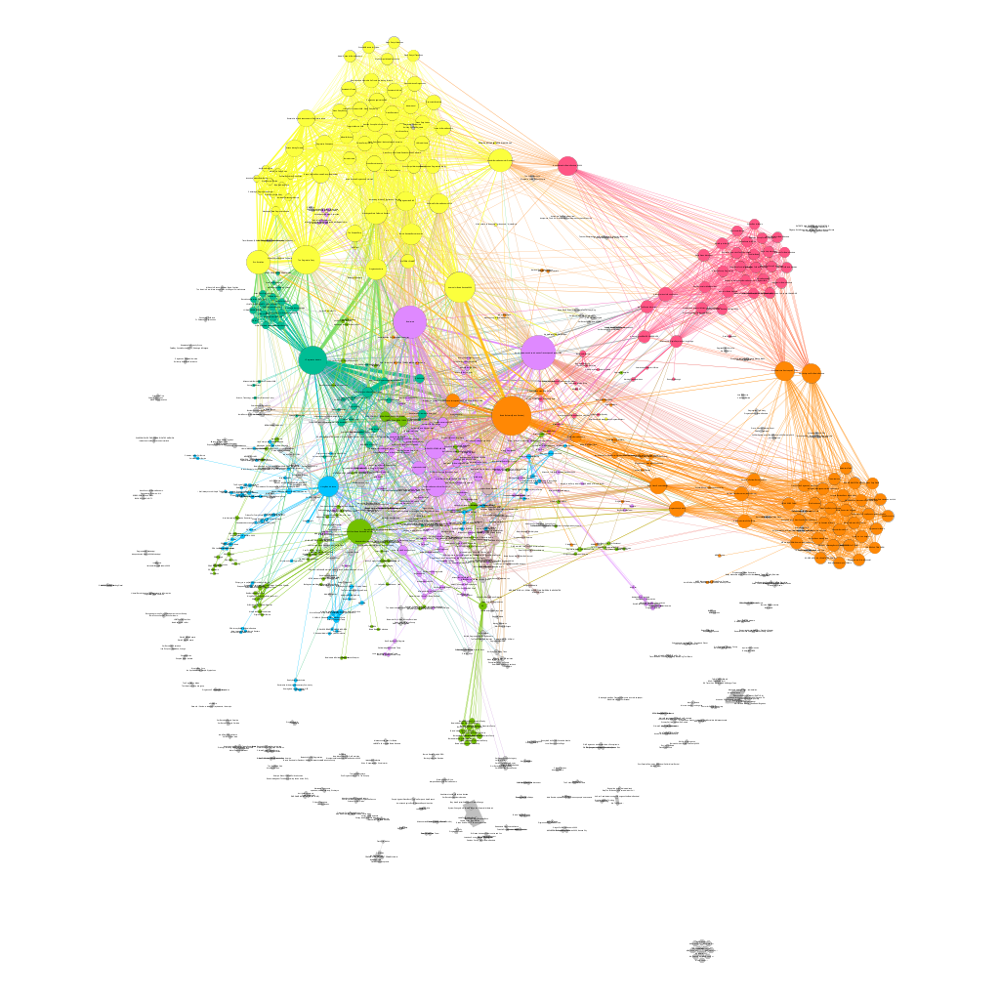

# Abstract

Gracias al uso masificado de las redes sociales y de su inmediatez, la difusión de noticias ha cobrado una relevancia importante, lo que antes tardaba una gran cantidad de tiempo en difundirse, ahora en solamente unos minutos puede volverse viral. Este tipo de comportamientos tienen una gran influencia en la opinión de las masas, ejemplos de esto son los resultados de votaciones populares como el plebiscito por la paz en Colombia del 2016, Las elecciones presidenciales de Estados Unidos de América o el referendo para que el Reino Unido abandonara la Unión Europa (llamado como Brexit). PyCoorNet una herramienta que permita analizar datos en una red social para descubrir patrones de comportamiento coordinado para compartir enlaces, con el fin de detectar intentos de volver viral una noticia.

# Summary
A partir de 6844 URLs extraidas del Condor URLs data set [@Bakshy1130] que continua

# Keywords
Social Networks, Facebook, CrowdTangle, Graphs, Coordinated behavior, CLSB, Python, Clustering, Community Detection

# Extracción y transformación de datos
A partir de un set de datos de 6844 URLs extraidas del Condor

# Cálculo del intervalo de coordinación
q (quantile of quickest URLs to be filtered): 0.1
p (percentage of total shares to be reached): 0.5
coordination interval from estimate_coord_interval: 25 secs

# Resultados

# Citations

Citations to entries in paper.bib should be in
[rMarkdown](http://rmarkdown.rstudio.com/authoring_bibliographies_and_citations.html)
format.

If you want to cite a software repository URL (e.g. something on GitHub without a preferred
citation) then you can do it with the example BibTeX entry below for @fidgit.

For a quick reference, the following citation commands can be used:
- `@author:2001`  ->  "Author et al. (2001)"
- `[@author:2001]` -> "(Author et al., 2001)"
- `[@author1:2001; @author2:2001]` -> "(Author1 et al., 2001; Author2 et al., 2002)"

# Figures
\autoref {fig:commondreams_graph}.

# Acknowledgements

We acknowledge contributions from Brigitta Sipocz, Syrtis Major, and Semyeong
Oh, and support from Kathryn Johnston during the genesis of this project.

# References
