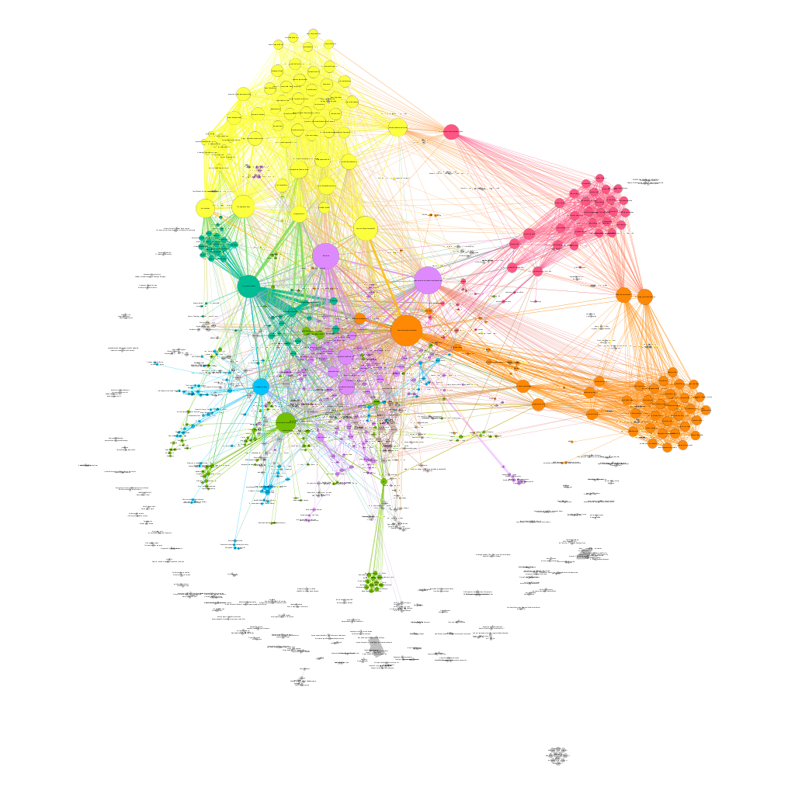

# Keywords
Social Networks, Facebook, CrowdTangle, Graphs, Coordinated behavior, CLSB, Python, Clustering, Community Detection

# Abstract

Gracias al uso masificado de las redes sociales y de su inmediatez, la difusión de noticias ha cobrado una relevancia importante, lo que antes tardaba una gran cantidad de tiempo en difundirse, ahora en solamente unos minutos puede volverse viral. Este tipo de comportamientos tienen una gran influencia en la opinión de las masas, ejemplos de esto son los resultados de votaciones populares como el plebiscito por la paz en Colombia del 2016, Las elecciones presidenciales de Estados Unidos de América o el referendo para que el Reino Unido abandonara la Unión Europa (llamado como Brexit). PyCoorNet una herramienta que permita analizar datos en una red social para descubrir patrones de comportamiento coordinado para compartir enlaces, con el fin de detectar intentos de volver viral una noticia.

# Detectando el comportamiento coordinado de intercambio de enlaces
Tomando 6.844 URLs extraidas del Condor URLs data set [@Bakshy1130], usando PyCrowdTangle [@pycrowdtangle] se hace una extracción de publicaciones de Facebook en CrowdTangle [@crowdtangle], una herramienta propiedad de Facebook que rastrea interacciones en contenido público de páginas y grupos de Facebook, perfiles verificados, cuentas de Instagram y subreddits. No incluye anuncios pagados a menos que esos anuncios comenzaran como publicaciones orgánicas y no pagas que posteriormente fueron "impulsadas" utilizando las herramientas publicitarias de Facebook. Tampoco incluye la actividad en cuentas privadas o publicaciones visibles solo para grupos específicos de seguidores, el resultado es total de 104.327 publicaciones válidas, las cuáles son análisadas por medio de PyCooRnet [@pycoornet] para detectar el comportamiento coordinado de intercambio de enlaces.

Datos los parámetros:

* Percentil donde se encuentrán las URL compartidas rápidamente: 10.

* Porcentaje de publicaciones investidadas: 50%.

Se obtiene un *intervalo de coordinación de 25 segundos*.

Este datos se utiliza para filtrar el data set y alimentar un modelo de clusterización que dá como resultado un grafo que nos permite detectar el fenómeno en cuestión. Usando herramientas de visualización de grafos como gephi [@ICWSM09154].

En \autoref {fig:commondreams_graph} los nodos representan las páginas de facebook que tienen un comportamiento coordinado, los colores representan el cluster al cual pertenece el nodo, y su tamaño la influencia de este grupo.

# Análisis de resultados

* Se encontraron 898 páginas o grupos diferenciados en 131 comunidades (clusters).

* El 50% de las páginas o grupos que tienen un comportamiento coordinado, están agrupadas en 7 comunidades. \autoref {fig:clusters}.

{width=60%}

* La página o grupo más influenciadores son:

| Página o grupo                                                                 | Fuerza | Suscriptores | Enlaces | Cluster |
|--------------------------------------------------------------------------------|--------|--------------|---------|---------|
| [1 Progressive Activists](https://www.facebook.com/940257989416472)            | 568    | 13.333       | 647     | 0       |
| [The Progressive Party](https://www.facebook.com/742985139150026)              | 497    | 12.331       | 139     | 1       |
| [Bernie Believers [Bernie Sanders]](https://www.facebook.com/1500083383618517) | 477    | 42.858       | 322     | 11      |
| [Berniecrats](https://www.facebook.com/547808012048444)                        | 420    | 43.976       | 367     | 5       |
| [America for Bernie Sanders 2020](https://www.facebook.com/208802505933373)    | 419    | 40.134       | 493     | 1       |

# Modelo
Siguiento la metodología propuesta en "It takes a village to manipulate the media: coordinated link sharing behavior during 2018 and 2019 Italian elections" [@Giglietto2020], se calcula el intervalo de coordinación tomando tomando para cada una de las URL, la diferencia de tiempo entre esta y el momento que fue compartida por primera vez.

$$firstShareDate = min(url[date])$$
$$url[secondsFromFirstShare] = url[date])-firstShareDate$$

Se calculan las publicaciones que compartieron estas URL con el percentil (parámetro dado por el usuario) con el intervalo de compartido más corto $url[secondsFromFirstShare]$.

Usando como parámetros *q* (cuantil de las URL más rápidas que se filtrarán) y *p* (el porcentaje del total de publicaciones que se analizarán), se promedian los tiempos y se calcula el *el intervalo de coordinacion*.

Usando este este valor se filtran las URLs (independiente de quien realiza la publicación) para filtras las URL que se compartieron dentro este umbral.

Esto nos permite detectar quienes comparten en un periodo de tiempo corto la misma URL, lo que caracteriza un comportamiento coordinado de intercambio de enlaces.

Para realizar un análisis de este comportamiento se construye un grafo. Usando el  método de clusterización Louvain para el análisis de comunidades [@Blondel2008], se detectan las páginas de Facebook que se comportan como una comunidad compartiendo enlaces entre sí y cuáles son sus nodos influenciadores.

Este grafo puede ser exportado a diferentes formatos como GEXF, GML, GraphML, etc. Para ser importado en herramientas de procesamiento y visualización de grafos, y así analizar el comportamiento de estas comunidades.

# References
