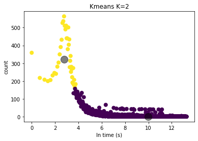
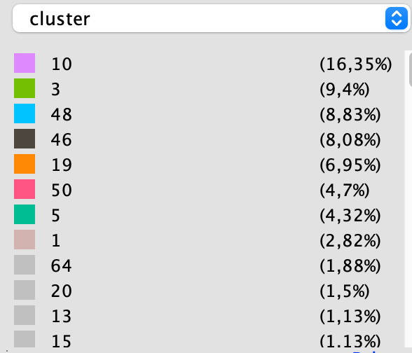

# Keywords
Social Networks, Facebook, CrowdTangle, Graphs, Coordinated behavior, CLSB, Python, Clustering, Community Detection

# Abstract

Gracias al uso masificado de las redes sociales y de su inmediatez, la difusión de noticias ha cobrado una relevancia importante, lo que antes tardaba una gran cantidad de tiempo en difundirse, ahora en solamente en unos minutos puede volverse viral. Este tipo de comportamientos tienen una gran influencia en la opinión de las masas, ejemplos de esto son los resultados de votaciones populares como el plebiscito por la paz en Colombia del 2016, Las elecciones presidenciales de Estados Unidos de América o el referendo para que el Reino Unido abandonara la Unión Europa (Brexit). Usando PyCoorNet [@pycoornet], una herramienta que permita analizar datos en una red social para descubrir patrones de comportamiento coordinado para compartir enlaces con el fin de detectar intentos de volver viral una noticia, se pretende analizar enlaces compartidos por TeleSur English en la red social Facebook [@facebook] con el objetivo de detectar este comportamiento.

# Detectando el comportamiento coordinado de intercambio de enlaces
Tomando 4.077 URLs extraidas del Condor URLs data set [@Bakshy1130], usando PyCrowdTangle [@pycrowdtangle] se hace una extracción de publicaciones de Facebook en CrowdTangle [@crowdtangle], una herramienta propiedad de Facebook que rastrea interacciones en contenido público de páginas y grupos de Facebook, perfiles verificados, cuentas de Instagram y subreddits. No incluye anuncios pagados a menos que esos anuncios comenzaran como publicaciones orgánicas y no pagas que posteriormente fueron "impulsadas" utilizando las herramientas publicitarias de Facebook. Tampoco incluye la actividad en cuentas privadas o publicaciones visibles solo para grupos específicos de seguidores, el resultado es total de 15.636 publicaciones válidas, las cuáles son análisadas por medio de PyCooRnet para detectar el comportamiento coordinado de intercambio de enlaces.

Realizando extracción, transformación y carga de los datos (ETL), se construye un set de datos el cual, por medio de técnicas de aprendizaje de máquinas y modelos no supervisados [@8713992] se obtiene un tiempo de coordinación que sirve como parámetro de entrada para un modelo que usa el  método de clusterización Louvain para el análisis de comunidades [@Blondel2008] sobre grafosm detecta las páginas y grupos de Facebook que se comportan como una comunidad compartiendo enlaces entre sí.

Usando herramientas de visualización de grafos como gephi [@ICWSM09154] podemos analizar el fenómeno en cuestión.


En \autoref {fig:telesur_graph} los nodos representan las páginas y grupos de facebook que tienen un comportamiento coordinado, los colores representan la comunidad al cual pertenece el nodo, y su tamaño la influencia de este grupo en el fenómeno analizado.

# Tiempo de coordinación
El tiempo coordinación es el umbral de tiempo en segundos en el cual se define que un enlace es compartido coordinadamente. Es normal que un mismo enlace sea compartido por diferentes entidades de una red social, no es normal que se compartan en un tiempo inusualmente corto, lo cuál lo conviernte en un sospechos de una viralización intencionada y posiblemente de un comportamiento coordinado para este fin.

En el artículo "Understanding Coordinated and Inauthentic Link Sharing Behavior on Facebook in the Run-up of 2018 General Election and 2019 European Election in Italy" [@Giglietto2019], usando ingeniería de características, los autores proponen calcular el tiempo de coordinación calculando los deltas en tiempo entre que se compartió por primera vez cada link y el resto de estos, asignándole a estos deltas un quantil al que pertenencen para luego filtrar los datos a la muestra poblacional objetivo.

Si bien, escogiendo correctamente el quantil y el tamaño de la muestra poblacidad, este es un método que fuciona bien para periodos de tiempo de estudio cortos, esta metodología supone que el fenómeno de viralización se genera inmediatamente se comparte por primera vez el link, de lo contrario los tiempos de coordinación se vuelven demasiado grandes y es susceptible a los datos atípicos.

Por lo tanto, se en el proyecto "Social Media Behaviour" de la Universidad Pontificia Bolivariana [@Bolivariana2021] se optó por utilizar técnicas de Aprendijade de Máquinas para detectar este tiempo de coordinación.

# Modelamiento

Usando la metodología propuesta por Giglieto, Righetti y Marino en el cuál el tiempo de coordinación se calcula buscando un delta de tiempo entre el momento en que se comparte por primera vez el enlace y el resto de veces que se comparte el mismo enlace, se obtienen los siguientes descriptores estadísticos


Siguiento la metodología propuesta en Giglieto, Righetti y Marino [@Giglietto2020], se calcula el intervalo de coordinación tomando tomando para cada una de las URL, la diferencia de tiempo entre esta y el momento que fue compartida por primera vez.

```py
firstShareDate = min(url['date'])
url['secondsFromFirstShare'] = url['date'])-firstShareDate
```
Se calculan rangos de las URL a partir de la fecha, organizándolas de menor a mayor
```python
url['rank'] = url[date].rank(ascending=True, method='first')
url['perc_of_shares'] = url[date].rank(ascending=True, method='average')
```
``url['rank']`` es usado para encontrar la segunda vez que se compartió esa URL, y así encontrar cuál fué el tiempo inusual más rápido.

``url['perc_of_shares']`` almacena el rango promedio dentro el grupo, ese valor se usa para filtrar con el pámetro *P*. [@pythonrank]


Se calculan las publicaciones que compartieron estas URL con el percentil (parámetro dado por el usuario) con el intervalo de compartido más corto ``url['secondsFromFirstShare']``.

Usando como parámetros *q* (cuantil de las URL más rápidas que se filtrarán) y *p* (el porcentaje del total de publicaciones que se analizarán), se promedian los tiempos y se calcula el *el intervalo de coordinacion*.

Usando este este valor se filtran las URLs (independiente de quien realiza la publicación) para filtras las URL que se compartieron dentro este umbral.

|      | Seg. desde el primer share |
|------|------------:|
| mean | 7.248.030   |
| std  | 1.986.423   |
| min  | 0           |
| 10%  | 0           |
| 20%  | 1.955       |
| 30%  | 10.863      |
| 40%  | 23.302      |
| 50%  | 40.108      |
| 60%  | 64.195      |
| 70%  | 110.119     |
| 80%  | 232.424     |
| 90%  | 38.289.150  |
| max  | 120.799.000 |


Se observa que los tiempos en los diferentes percentiles es demasiado alto y se obtienen demasiados datos atípicos. Con esta metodología debe empezar a iterear con los diferentes quantiles y submuestras poblacionales, con el alto tiemplo de procesamiento y análisis que esto implica.

En el proyecto decidimos utilizar un modelo no supervisado para calcular el tiempo de coordinación.

El set de datos se agrupó por enlace y se organizó por fecha y hora en que se compartío, par aluego calcular el delta entre cada uno de los enlaces con el fin de crear un histograma de estos deltas, independiente del enlace. Con esto eliminamos el posible sesgo de tiempo que se genera si el tiempo entre que se comparte el primer enlace y el momento en que se comparte "viralmente" es alto.

Se cambiaron los deltas de tiempo a una escala logarítmicaa y analizamos el histograma.


Usando K-means, se realiza realiza una clusterización de los datos y entrar a analizar los centroides.

Para escoger el valor K adecuado se usan el análisis del SSE y de la silueta.


Analizando los resultados se concluye que el valor de K es igual a 2.

Con este valor de K el resultado del cluster el se siguiente:




Se observa claramente que los clusters están muy definidos con sus centroides muy separados entre ellos, lo cuál se puede comprobar con una prueba de diferencia de medias.

En el cluster de color violeta están concentrados los enlaces que su delta de tiempo de compartición entre ellos es el más bajo y con una cantidad alta.

El el cluster de color amarillo se encuentran los enlaces con un delta de tiempo alto y con poca cantidad.

Esto nos permite observar que el cluster violeta pertenece a los enlaces con un posible comportamiento coordinado.

Usando el centroide de este cluster obtenemos un t en base  t=2.84s en base logarítmica , lo que equivale a t=17s en base decimal.

Este tiempo de coordinación lo usamos como parámetro para los otros modelos que dan como resultado los enlaces que se comportan como el fenómeno que estamos analizando y un grafo con las comunidades de entidades que lo realizan.


# Análisis de resultados

* Se encontraron 898 páginas o grupos diferenciados en 131 comunidades (clusters).

* El 50% de las páginas o grupos que tienen un comportamiento coordinado, están agrupadas en 7 comunidades. \autoref {fig:clusters}.

{width=60%}

* La página o grupo más influenciadores son:

| Página o grupo                                                                 | Fuerza | Suscriptores | Enlaces | Cluster |
|--------------------------------------------------------------------------------|--------|--------------|---------|---------|
| [1 Progressive Activists](https://www.facebook.com/940257989416472)            | 568    | 13.333       | 647     | 0       |
| [The Progressive Party](https://www.facebook.com/742985139150026)              | 497    | 12.331       | 139     | 1       |
| [Bernie Believers [Bernie Sanders]](https://www.facebook.com/1500083383618517) | 477    | 42.858       | 322     | 11      |
| [Berniecrats](https://www.facebook.com/547808012048444)                        | 420    | 43.976       | 367     | 5       |
| [America for Bernie Sanders 2020](https://www.facebook.com/208802505933373)    | 419    | 40.134       | 493     | 1       |


# References
